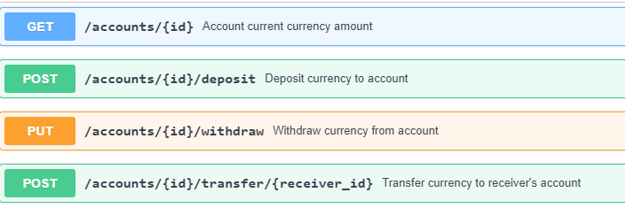

## Exemplo de API REST para um Banco feita em .NET

Uma documentação detalhada da API com endpoints e exemplos de respostas se encontra no arquivo BankApiSwagger.yaml .

Para uma representação gráfica acesse o site : 
https://app.swaggerhub.com

